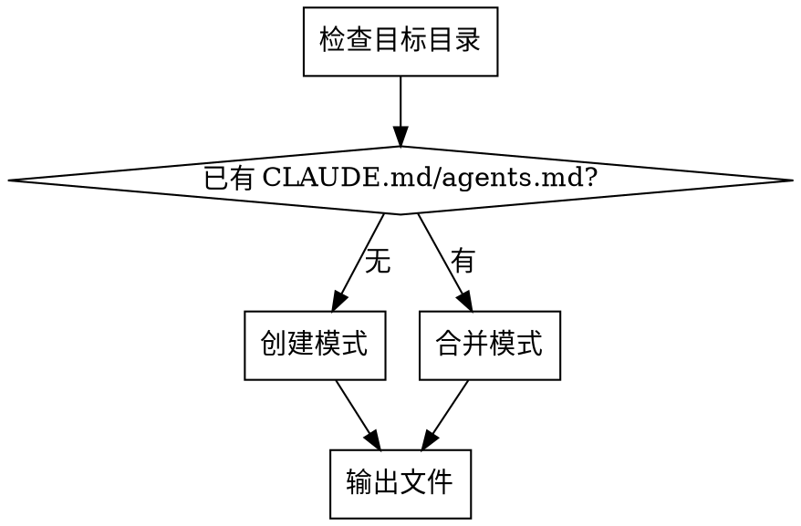

# my-superpowers-md

为目标项目创建或合并 `CLAUDE.md` / `agents.md`。模板基于 Karpathy 核心原则，以单一约束表整合行为规范。

## 工作流



## 创建模式

目标目录无 `CLAUDE.md` / `agents.md` 时执行：

1. 用引导式提问收集项目信息（见下方"引导式提问"）
2. 基于模板生成文件
3. 输出文件名：Claude Code → `CLAUDE.md`，Codex/OpenCode/Hermes → `agents.md`

## 合并模式

目标目录已有文件时执行：

1. 逐模块分析已有文件
2. 与模板模块对比
3. 不冲突 → 保留已有内容
4. 冲突 → 列出差异，让用户选择
5. 缺失 → 从模板补充
6. 输出文件名遵循目标 agent 命名约定

## 引导式提问

应用模板时，主动向用户询问：

- 用户背景/角色
- 项目技术栈和开发命令（安装、测试、启动、构建）
- 项目架构概览（核心模块、数据流、关键依赖）

## 模板

生成的文件结构如下：

```markdown
# CLAUDE.md

本文档为强制性规范，非建议性指南。

## 交流规范

- 必须使用中文交流
- 英文术语必须后附中文解释，例如：`background_color-背景颜色`、`callback function-回调函数`

## 执行策略

- 每次行动前，必须先检索当前可用的 skills，寻找匹配的 skill 提高执行质量
- 可并行的任务，必须派出多个 sub-agent 并行完成
- 主 agent 完成任务时，必须自动回收所有 sub-agent，清理临时文件，不留悬空进程
- 禁止在未完成回收的情况下结束任务

## 行为约束表

| 原则 | 必须做 | 禁止做 | 验证方式 |
|------|--------|--------|----------|
| 编码前思考 | 明确假设；列出多种解读；提出更简方案 | 不确定时自行假设 | 假设是否已列出？ |
| 简洁优先 | 最少代码解决 | 超需求功能；单次使用抽象；推测性代码 | 行数是否最少？ |
| 外科手术式修改 | 只改必须改的；匹配风格；清理自己的孤立代码 | 改动未要求的相邻代码 | 每行修改可追溯？ |
| 目标驱动执行 | 定义可验证目标；多步骤先陈述计划 | 未定义标准就执行 | 成功标准明确？ |
| 测试约束 | 使用真实数据 | 假设测试数据 | 数据来源真实？ |
| 子代理管理 | 完成时全部回收 | 留悬空进程 | 有未回收子代理？ |
| 需求确认 | 理解后再动手 | 未明确需求就编码 | 需求已确认？ |
| 复用优先 | 复杂任务先搜索开源工具/社区方案；有成熟方案直接采用 | 有现成方案仍重复造轮子 | 是否已搜索现有方案？ |

## 用户背景

<!-- 引导式提问填充 -->

## 开发命令

<!-- 引导式提问填充 -->

## 架构概览

<!-- 引导式提问填充 -->
```
